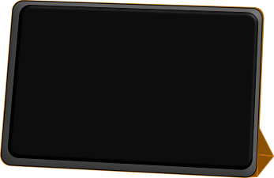

autoscale: true
footer: ET861 - Markus Schäfer - Matr.Nr. 945229

# **Einfach-Elster-App**

Entwicklung einer Begleit-App zur Registrierung beim 
Online-Steuererklärungstool "Mein Elster"
der Bundesfinanzverwaltung

---

# Ausgangssituation

bis 2018

* ElsterFormular
* ElsterOnline

---

# "Elster-Formular"
* Desktop-Anwendung
* Vorteil:
   	* Optik entspricht den Formularen
	* Registrierung nicht notwendig (mit Einschränkungen)
* Nachteil:
	* nicht alle Formulare verfügbar
	* ohne Registrierung keine papierlose Erklärungsübermittlung 
	
---

# "ElsterOnline" jetzt _**"Mein Elster"**_	
* Webanwendung
* Vorteil: 
	* alle Formulare
	* papierlose Erklärungsübermittlung
* Nachteil:
   	* klassische Formularansicht nicht verfügbar 
   	* zwingende Online-Verbindung
   	* zwingende Registrierung	

---

# Situation ab 2019

# Mein Elster

---

# Projektidee:

Geringe Abzeptanz von "Mein Elster"

Entwicklung einer Unterstützungs-App 
zur Registrierung in "Mein Elster"

---

# Feature
 * mehrere Benutzer
 * Speichern von Eingabedaten
 * Anzeige von Erklärvideos

---

# Welche Plattform?

Zur Auswahl stehen:
1. PC-Anwendung 

---

# Welche Plattform?

Zur Auswahl stehen:
1. PC-Anwendung 
2. Smartphone-App 

---

# Welche Plattform?

Zur Auswahl stehen:
1. PC-Anwendung 
2. Smartphone-App 
3. Tablet-App 

---

# PC-Anwendung
- Nutzung hauptsächlich im Vollbild
* => Viel Unruhe auf dem Bildschirm	
	* Streß
	* weite Mauswege	 

---

# Smartphone-App 
* Smartphone wird in der Hand gehalten
* extremer Größenunterschied
* "fummelige" Eingabe

---

# Tablet

* durch Verwendung einer Hülle relativ kleine Standfläche
* geringerer Größenunterschied beim Display
* einfachere  Bedienung

---

# Live-Präsentation
